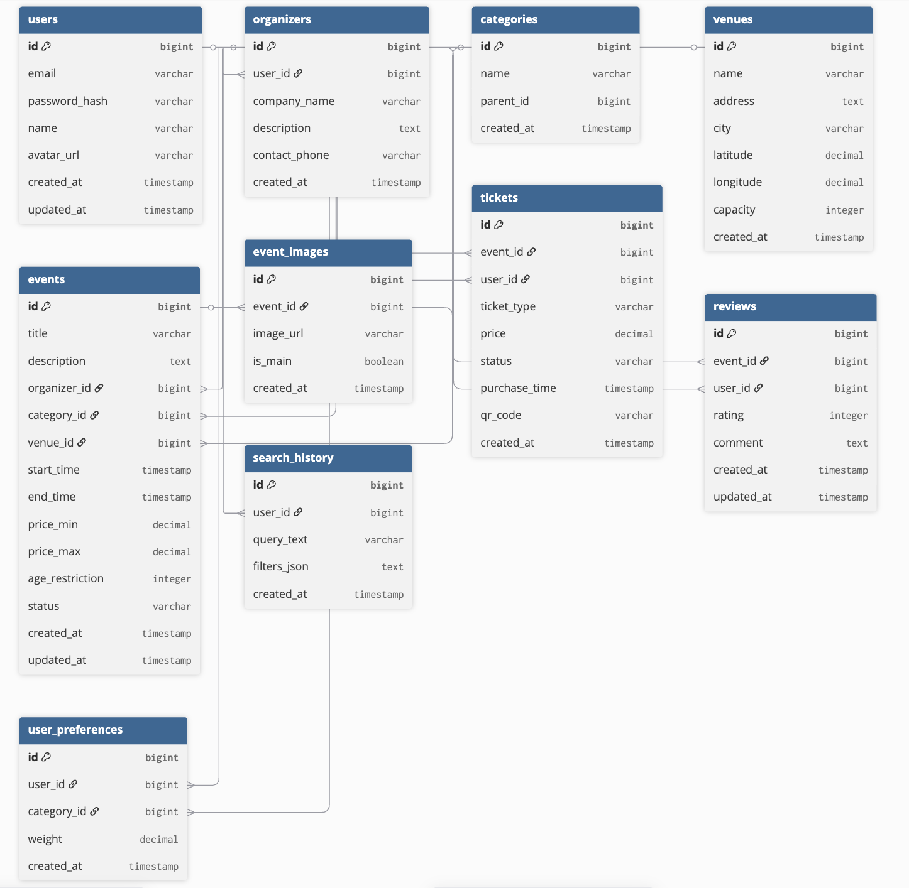

# Проектирование высоконагруженной системы: Яндекс Афиша

## 1. Тема и целевая аудитория

**Тип сервиса**
Агрегатор мероприятий с системой рекомендаций и онлайн-покупкой билетов (B2C SaaS).

**Аналоги**
- Timepad
- Kassir.ru  
- Яндекс Афиша (оригинал)

**Функционал MVP**
- Поиск и фильтрация мероприятий по категориям, дате, локации
- Покупка билетов онлайн
- Регистрация, авторизация
- Личный кабинет организатора для добавления мероприятий
- Отзывы с оценками мероприятий(от 1 до 5)
- Главная страница с рекомендациями

**Продуктовые решения**
- Микросервисная архитектура (Поиск, Рекомендации, Билеты, Пользователи, Мероприятия)
- Активное кеширование данных мероприятий и билетов "на горячих" событиях
- Асинхронная обработка платежей и выдачи билетов
- ML-модели для рекомендаций на основе предпочтений и поведения пользователей
- Интеграция с Яндекс.Картами для отображения локаций

**Целевая аудитория**

| Параметр | Значение | Источник |
|----------|----------|----------|
| MAU | 8,000,000 | [SimilarWeb] + данные экосистемы Яндекс |
| DAU | 1,600,000 | 20% от MAU |
| География | 85% - Россия, 10% - СНГ, 5% - другие страны | [SimilarWeb] |
| Основная аудитория | 18-45 лет, городские жители | Рыночные исследования |

## 2. Расчет нагрузки

**Продуктовые метрики**

| Метрика | Значение | Источник / Обоснование |
|---------|----------|------------------------|
| Среднее количество сессий на пользователя в день | 1.2 | Оценка: планирование мероприятий 2-3 раза в неделю |
| Средняя длительность сессии | 8 минут | Аналоги: SimilarWeb (Timepad) |
| Количество просмотров мероприятий на сессию | 12 | Оценка: просмотр 2-3 страниц результатов + детализация |
| Процент пользователей, покупающих билеты | 5% | Отраслевая статистика для event-аггрегаторов |
| Среднее количество покупок на платящего пользователя в месяц | 1.5 | Оценка |
| Средний размер JSON-ответа мероприятия | 15 КБ | Основные данные без статики |

**Технические метрики**

### Прирост пользователей (на 2 года)
- **Текущий MAU:** 8,000,000
- **Прогнозируемый рост:** 20% в год
- **MAU через 1 год:** 9,600,000
- **MAU через 2 года:** 11,520,000

#### Объем хранилища

| Тип данных | Кол-во объектов | Средний размер | Общий объем |
|------------|----------------|----------------|-------------|
| Профили пользователей | 11,520,000 | 5 КБ | 57.6 ГБ |
| Мероприятия (активные + архив) | 3,000,000 | 50 КБ | 150 ГБ |
| Изображения | 15,000,000 | 500 КБ | 7.5 ТБ |
| Отзывы | 40,000,000 | 2 КБ | 80 ГБ |
| Билеты | 38,400,000 | 10 КБ | 384 ГБ |
| Заказы | 38,400,000 | 5 КБ | 192 ГБ |
| **ИТОГО** | **—** | **—** | **~8.4 ТБ** |

*Расчет билетов:* 1,600,000 DAU × 5% × (1.5 покупок/мес / 30 дней) × 730 дней = 19,200,000 билетов

#### Сетевой трафик

| Тип трафика | Среднее значение (ГБ/день) | Пиковое значение (Гбит/с) |
|-------------|----------------------------|---------------------------|
| Просмотр мероприятий | 460.8 ГБ/день | 42.7 Гбит/с |
| Отзывы (чтение) | 175.8 ГБ/день | 16.3 Гбит/с |
| Поисковые запросы | 4.9 ГБ/день | 0.45 Гбит/с |
| Покупка билетов | 1.5 ГБ/день | 0.14 Гбит/с |
| Загрузка изображений (CDN) | 36 ГБ/день | 3.3 Гбит/с |
| **ИТОГО исходящий** | **~212 ГБ/день** | **~19.6 Гбит/с** |
| **ИТОГО входящий** | **~467 ГБ/день** | **~43.2 Гбит/с** |

#### RPS (Requests Per Second)

| Тип запроса | Средний RPS | Пиковый RPS (x5) |
|-------------|-------------|------------------|
| GET /events/search (поиск мероприятий) | 44.4 | 222 |
| GET /events/{id} (просмотр мероприятия) | 267 | 1335 |
| POST /tickets/purchase (покупка билета) | 1.9 | 9.5 |
| GET /recommendations (персональные рекомендации) | 44.4 | 222 |
| POST /events (добавление мероприятия) | 0.9 | 4.5 |
| **ИТОГО** | **~358.6 RPS** | **~1793 RPS** |

**Детализация расчетов**

- **DAU:** 1,600,000
- **Просмотр мероприятий (GET /events/{id}):**
  - Запросов в день: 1,600,000 × 1.2 сессии × 12 просмотров/сессию = 23,040,000
  - Средний RPS: 23,040,000 / 86400 сек = **266.7 RPS** (округлим до 267)

- **Поиск и рекомендации (GET /events/search, GET /recommendations):**
  - Запросов в день: 1,600,000 × 1.2 сессии × 2 запроса/сессию = 3,840,000 (на каждый тип)
  - Средний RPS: 3,840,000 / 86400 сек = **44.4 RPS** (на каждый)

- **Покупка билетов (POST /tickets/purchase):**
  - Покупок в день: 1,600,000 × 5% = 80,000
  - Запросов на покупку: 80,000 × 2 = 160,000 (корзина + подтверждение)
  - Средний RPS: 160,000 / 86400 = **1.85 RPS** (округлим до 1.9)

## 3. Глобальная балансировка нагрузки

#### 3.1. Функциональное разбиение по доменам

- **`api.afisha.ru`** (основное API): Пользователи, Мероприятия, Поиск, Комментарии
- **`pay.afisha.ru`** (платежный шлюз): Обработка платежей, выпуск билетов
- **`cdn.afisha.ru`** (контентная сеть): Обслуживание изображений мероприятий, статических assets

#### 3.2. Обоснование расположения ДЦ

**Главная задача:** Обеспечить низкую задержку при поиске мероприятий и покупке билетов, так как это напрямую влияет на конверсию и удовлетворенность пользователей.

**Распределение аудитории и расположение ДЦ:**
- **85% трафика (Россия):** Основная аудитория
    - **ДЦ-1 (Москва):** Обслуживает Центральный регион
    - **ДЦ-2 (Санкт-Петербург):** Обслуживает Северо-Запад и часть Европы
    - **ДЦ-3 (Екатеринбург):** Обслуживает Уральский регион и часть Сибири
- **10% трафика (СНГ):**
    - **ДЦ-4 (Казахстан, Алматы):** Обслуживает Среднюю Азию

#### 3.3. Схема DNS балансировки

Используем **Latency-based (GeoDNS) Routing**
- Пользователь запрашивает `api.afisha.ru`
- DNS-провайдер определяет его местоположение и возвращает IP-адрес того ДЦ, который имеет наименьшую сетевую задержку
- Например, пользователь из Новосибирска будет направлен в ДЦ-3 (Екатеринбург)

#### 3.4. Схема Anycast балансировки

**Anycast** идеально подходит для `cdn.afisha.ru` и `pay.afisha.ru`
- **Для CDN:** Один IP-адрес анонсируется всеми ДЦ. Пользователь всегда попадает на ближайший узел
- **Для платежного шлюза:** Anycast обеспечивает отказоустойчивость. Если один ДЦ недоступен, трафик автоматически перенаправляется

#### 3.5. Механизм регулировки трафика между ДЦ

- **Балансировка чтения:** Поисковые запросы и запросы на просмотр мероприятий обрабатываются ближайшим ДЦ
- **Балансировка записи:** Запросы на создание мероприятий и покупку билетов перенаправляются в основной ДЦ (Москва) для консистентности
- **Active-Active:** Все ДЦ активно обрабатывают запросы

## 4. Локальная балансировка нагрузки

#### 4.1. Схема балансировки нагрузки

Используем многоуровневую схему для отказоустойчивости и эффективного распределения нагрузки

**Уровень 1:** L4 Load Balancer (HAProxy) - TCP-балансировка, SSL Termination  
*(Схема резервирования: Active/Active)*  
**Уровень 2:** L7 Load Balancer (Nginx Ingress) - HTTP-маршрутизация, кеширование  
*(Схема резервирования: N+1)*  
**Уровень 3:** Kubernetes Service (kube-proxy) - Внутрикластерная балансировка  
**Уровень 4:** Pods (микросервисы) - Поиск, Билеты, Пользователи, Рекомендации...

```
Интернет → L4 LB → L7 LB → kube-proxy → Pods
```


**Формула резервирования: N+1**
- На каждом уровне развертывается на один узел больше, чем требуется для обработки пиковой нагрузки

#### 4.2. Расчёт количества балансировщиков

**Исходные данные:**
- **Пиковый RPS:** ~1793 RPS
- **Пиковый трафик (входящий):** ~32.4 Гбит/с

**Ограничивающие факторы для L7-балансировщиков (Nginx):**
1. **SSL Termination:** ~10,000 CPS на 24 CPU
2. **Пропускная способность сети:** 10 Гбит/с на сетевой интерфейс

**Расчет по пропускной способности сети:**
- Пиковый входящий трафик: ~32.4 Гбит/с
- Пропускная способность одного балансировщика: 10 Гбит/с
- **Необходимое количество для обработки трафика:** 32.4 / 10 = 3.24 → **4 балансировщика**

**Применяем схему резервирования N+1:**
- Для обработки трафика нужно 4 балансировщика
- Для отказоустойчивости добавляем 1 дополнительный
- **Итого необходимо L7-балансировщиков: 5**

Каждый балансировщик представляет собой виртуальную машину с 8-16 CPU, 16-32 ГБ ОЗУ и сетевым интерфейсом 10 Гбит/с.

## 5. Логическая схема БД



### 📋 Таблица с описанием сущностей

| Таблица | Назначение | Основные поля | Средний размер строки | QPS чтения / записи |
|---------|------------|---------------|----------------------|-------------------|
| users | Профили пользователей | id, email, name, avatar_url | ~500 Б | R: 50k / W: 5k |
| organizers | Организаторы мероприятий | id, user_id, company_name, contact_phone | ~300 Б | R: 10k / W: 1k |
| categories | Категории мероприятий | id, name, parent_id | ~100 Б | R: 5k / W: 100 |
| venues | Места проведения | id, name, address, city, coordinates | ~400 Б | R: 15k / W: 500 |
| events | Мероприятия | id, title, description, dates, prices | ~2 КБ | R: 200k / W: 20k |
| event_images | Изображения мероприятий | id, event_id, image_url, is_main | ~200 Б | R: 100k / W: 10k |
| tickets | Билеты | id, event_id, user_id, price, status | ~300 Б | R: 80k / W: 15k |
| reviews | Отзывы и оценки | id, event_id, user_id, rating, comment | ~500 Б | R: 30k / W: 5k |
| user_preferences | Предпочтения для рекомендаций | id, user_id, category_id, weight | ~100 Б | R: 20k / W: 3k |
| search_history | История поиска | id, user_id, query_text, filters | ~400 Б | R: 10k / W: 8k |

### ⚙️ Требования к консистентности

| Таблица | Модель консистентности | Обоснование |
|---------|------------------------|-------------|
| users | Strong | Данные аутентификации должны быть строго консистентны |
| organizers | Strong | Информация об организаторах критична для доверия |
| events | Strong | Актуальность информации о мероприятиях и билетах |
| tickets | Strong | Предотвращение продажи одних и тех же билетов |
| venues | Strong | Геоданные должны быть точными |
| reviews | Eventual | Отзывы могут реплицироваться с задержкой |
| user_preferences | Eventual | Предпочтения не критичны к мгновенной синхронизации |
| search_history | Eventual | История поиска допускает расхождения |

### 🔑 Распределение нагрузки по ключам

| Таблица | Ключи для распределения | Особенности |
|---------|-------------------------|-------------|
| users | id | Равномерное распределение по UUID |
| events | id + city | Географическое шардирование по городам |
| tickets | event_id | Группировка билетов по мероприятиям |
| reviews | event_id | Локализация отзывов по событиям |
| venues | city | Географическое распределение мест |
| search_history | user_id | Персонализация истории поиска |

## 6. Физическая схема БД

### 6.1 Выбор СУБД по таблицам

| Таблица | СУБД | Обоснование |
|---------|------|-------------|
| users | PostgreSQL | Strong consistency, сложные запросы профилей |
| organizers | PostgreSQL | Связь с пользователями, ACID-транзакции |
| categories | PostgreSQL | Статические данные, редко меняются |
| venues | PostgreSQL + PostGIS | Географические запросы |
| events | Cassandra | Высокая нагрузка чтения, географическое шардирование |
| event_search_index | Elasticsearch | Полнотекстовый поиск, фасетный поиск |
| image_urls | PostgreSQL + AWS S3 | Метаданные в PG, файлы в S3 + CDN |
| orders | PostgreSQL | Транзакционность заказов |
| tickets | PostgreSQL | Транзакционность, связь с заказами |
| event_ticket_counters | Redis | Atomic инкременты, быстрый доступ |
| reviews | Cassandra | Высокая частота записи отзывов |
| user_preferences | Redis | Быстрый доступ для рекомендаций |
| search_history | PostgreSQL | Структурированные данные, аналитика |

### 6.2 Индексы

```sql
-- PostgreSQL индексы
CREATE INDEX idx_users_email ON users(email);
CREATE INDEX idx_organizers_user_id ON organizers(user_id);
CREATE INDEX idx_venues_city ON venues(city);
CREATE INDEX idx_events_organizer ON events(organizer_id);
CREATE INDEX idx_events_category ON events(category_id);
CREATE INDEX idx_events_city_date ON events(city, start_time);
CREATE INDEX idx_tickets_event_user ON tickets(event_id, user_id);
CREATE INDEX idx_tickets_status ON tickets(status);
CREATE INDEX idx_reviews_event_rating ON reviews(event_id, rating);

-- Cassandra индексы (вторичные)
CREATE INDEX idx_events_city ON events(city);
CREATE INDEX idx_events_start_time ON events(start_time);
```

### 6.3 Денормализация

| Таблица | Денормализованные поля | Цель |
|---------|------------------------|------|
| events | venue_name, city, category_name | Ускорение поиска без JOIN |
| tickets | event_title, event_date, venue_name | Быстрое отображение в ЛК |
| reviews | user_name, event_title | Отображение без дополнительных запросов |
| user_preferences | category_names[] | Быстрые рекомендации |

### 6.4 Шардирование и резервирование

| Таблица | Тип шардирования | Резервирование |
|---------|------------------|----------------|
| users | user_id mod N | PostgreSQL: 1 master + 2 replicas |
| events | city (геошардирование) | Cassandra: RF=3, каждый регион |
| tickets | event_id mod N | PostgreSQL: шардирование по событиям |
| venues | city | PostgreSQL: географическое распределение |
| reviews | event_id mod N | Cassandra: RF=3 |
| search_history | user_id mod N | Elasticsearch: 3 реплики на шард |

### 6.5 Клиентские библиотеки / интеграции

- **PostgreSQL**: `psycopg2` (Python), `HikariCP` (Java)
- **Cassandra**: `cassandra-driver` (Python), `DataStax Java Driver`
- **Redis**: `redis-py`, `Lettuce` (Java)
- **Elasticsearch**: `elasticsearch-py`, `RestHighLevelClient` (Java)
- **AWS S3**: `boto3` (Python), `AWS SDK` (Java)

### 6.6 Балансировка запросов / мультиплексирование

- **PostgreSQL**: PgBouncer + HAProxy для connection pooling
- **Cassandra**: Token-aware load balancing в драйвере
- **Redis**: Redis Cluster с автоматическим шардированием
- **Elasticsearch**: Coordinating nodes для распределения запросов

### 6.7 Схема резервного копирования

| СУБД | Стратегия бэкапа | RTO/RPO |
|------|------------------|----------|
| PostgreSQL | WAL-архивирование + pgBackRest | RTO: 15 мин, RPO: 5 мин |
| Cassandra | Incremental snapshots + commitlog | RTO: 30 мин, RPO: 1 час |
| Redis | RDB snapshots + AOF | RTO: 5 мин, RPO: 1 мин |
| Elasticsearch | Snapshot to S3 | RTO: 20 мин, RPO: 15 мин |
| AWS S3 | Versioning + Cross-region replication | RTO: 1 мин, RPO: 0 |

**Расписание бэкапов:**
- Ежедневные полные бэкапы в 02:00
- Инкрементальные каждые 4 часа
- WAL-архивы каждые 5 минут
- Snapshot S3 - ежечасно

### Источники
- SimilarWeb: https://www.similarweb.com/ru/website/afisha.yandex.ru/
- Данные экосистемы Яндекс (экстраполяция)
- Отраслевая статистика event-индустрии